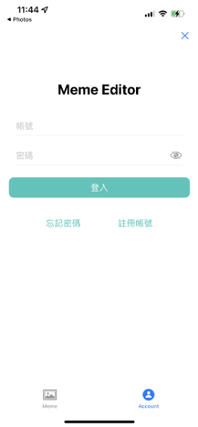
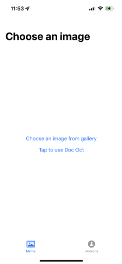
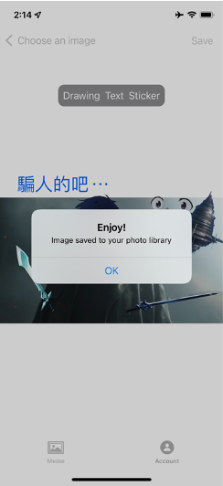
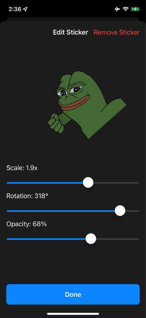

# MemeEditor
For architecture and more details please refer to ```OOAD_report.pdf```. \
The latest changes are at the dev branch.\
This project is created for the NTUT OOAD course, some features are not completed yet.

## screenshots




